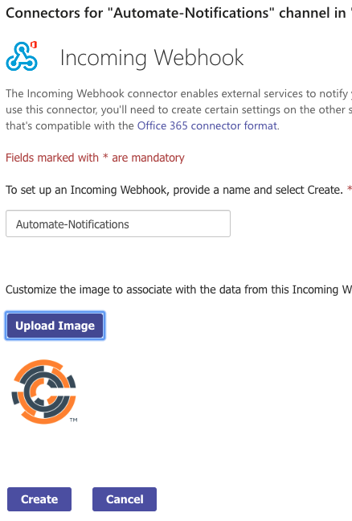

# Chef Automate Teams Notifications

## Introduction

Greetings! This repo contains a workaround to allow [Chef Automate](https://automate.chef.io) to send failure notifications to [Microsoft Teams](https://teams.microsoft.com)

## Components

To facilitate the notifications, this repo uses an [Azure Function](https://azure.microsoft.com/en-us/services/functions/) with an `HttpTrigger` to intercept the webhook from Automate, translate it into a payload for Teams, then send that new payload to the Teams webhook URL.

## Usage

It may feel weird, but we need to set up things starting at the destination, then working back to the origination of the notification.

### Teams

The first task is to set up a channel and a webhook connector. If you want send the notifications to an existing channel, skip to the create connector steps.

1. Create a channel by clicking the `...` to the right of the team name, then select `add channel`

1. Next, click the `...` to the right of the channel name, then select `connectors`
1. Now, select `Configure` for the `Incoming Webhook` connector

1. Give the connector a name and provide a icon if desired, then click `Create`

1. Finally, copy the webhook URL for use in the next section.

### Azure Function

### Automate
